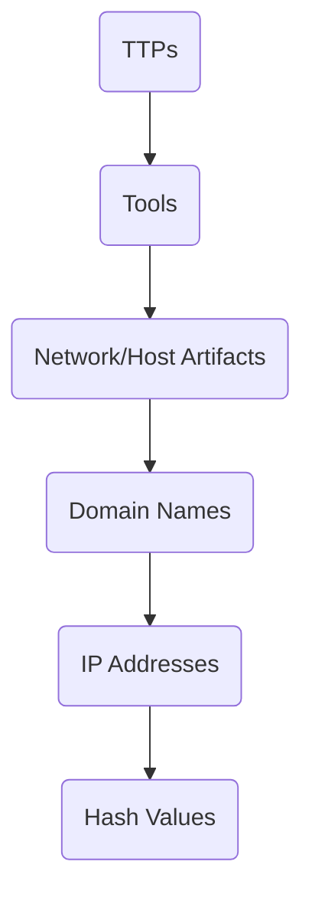
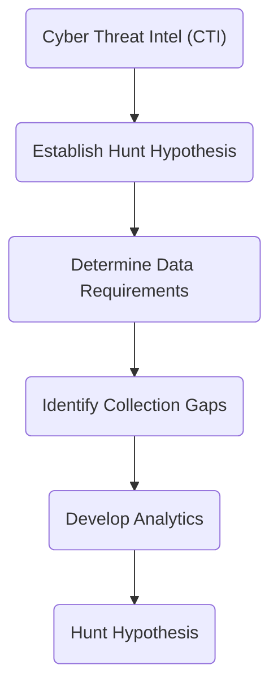

---
tags:
  - security
MOC: "[[Security Concepts MOC]]"
---
-- --
# Cyber Threat Intelligence (CTI)
## Threat Specific vs. Threat Agnostic
### Threat Agnostic

Threat agnostic are not specific to an adversary following a general approach and scan systems for the presence of TTPs. 
### Threat Specific

Threat specific is based on timely intelligence specific to the adversary with techniques and tools for prioritized TTPs while determining CPT ability and focusing the hunt on. 
## TTP Oriented Model (TOM)

Also called the pyramid of pain, high confidence and intel driven focus hunt.

Create TOM by creating an organized representation of a specific adversary TTP and finding the weak point. 
# Hunt Hypothesis

Based on Cyber Threat Intelligence (CTI) and Unit reporting. Gather TTPs with MITRE ATT&CK, and base hypothesis from TTP.
## Data Requirements/Collection Gaps

* What IOCs can confirm the hypothesis?
* What can/can't I see?
* What do I have access to?
* Will I have all my tools available (check with mission lead)?
* Currently active?

## Develop Analytics

Look for network packets through Arkime and Kibana based on the data requirements and hunt hypothesis. 

Create Suricata rules for traffic to limit false positives and avoid operators from over-saturation.

## Test  Hunt Hypothesis

Report malicious activity or new hypothesis for no traffic.