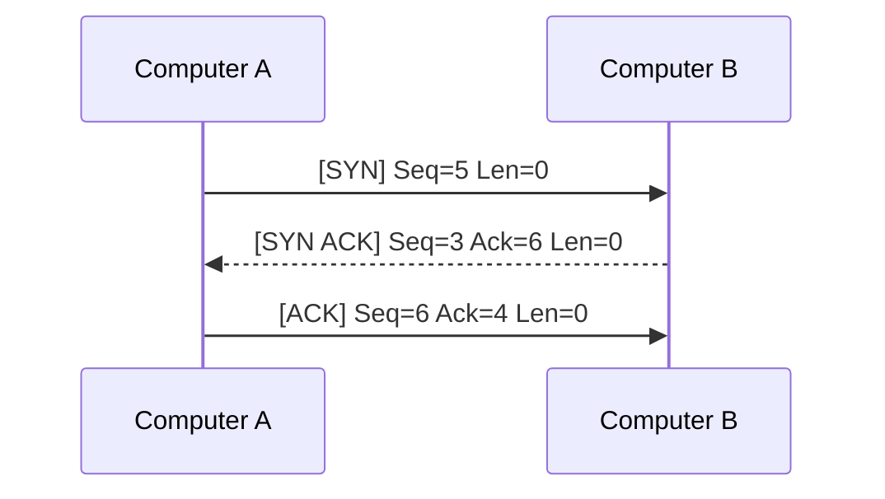
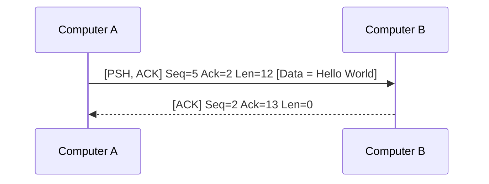
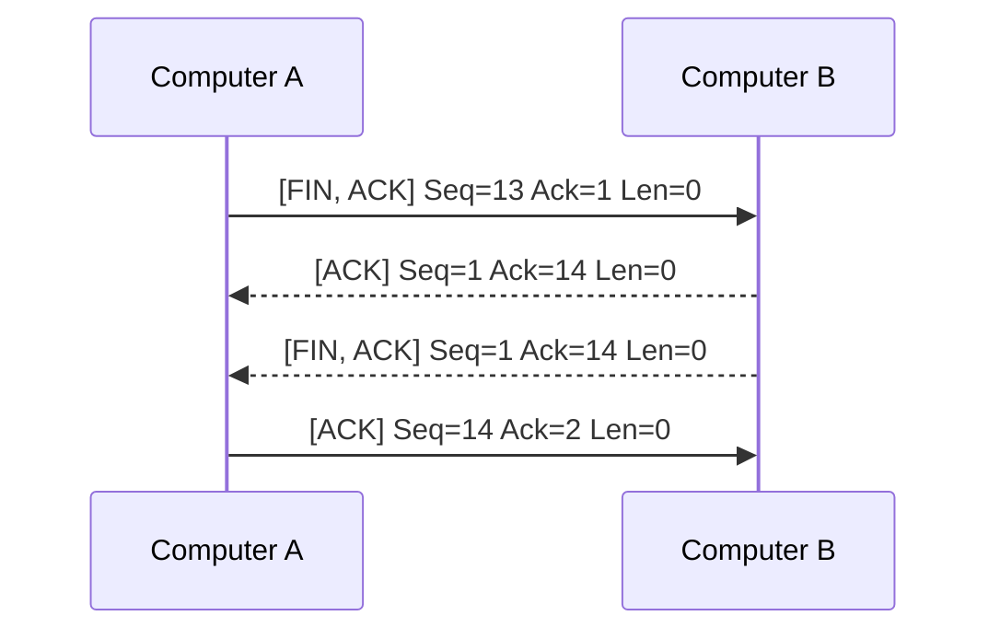

#network 
[[Network MOC]]
- - -

The Transmission Control Protocol focuses on reliability and is common for most tasks. Setup requires a handshake and can retransmit data. The downside of TCP is its slow transmission compared to the [[UDP Protocol]]. 

# Handshake

1. Computer A sends packet with the synchronize flag (`SYN`) to computer B with a randomly generated sequence number.
2. Computer B replies with synchronize flag (`SYN`) and acknowledge flag (`ACK`) containing another random number and the acknowledgement number, which is the sequence number of Computer A incremented by 1.
3. Computer A responds with just the acknowledge flag (`ACK`) and their acknowledgment number.

# Transmission

Unlike the handshake and teardown, data is sent with the `Len` showing length of data and the next acknowledge number is the previous `Len` + 1.

# Teardown

1. Computer A sends a finish packet (`FIN`) with current sequence number. The `ACK` is to acknowledge the previous package.
2. Computer B responds with `ACK` with acknowledgment number as Computer A's sequence number incremented by 1.
3. Computer B sends a `FIN` + `ACK` with same acknowledgment number.
4. Computer A sends a `ACK` packet with acknowledgment number as Computer B's sequence number incremented by 1.

