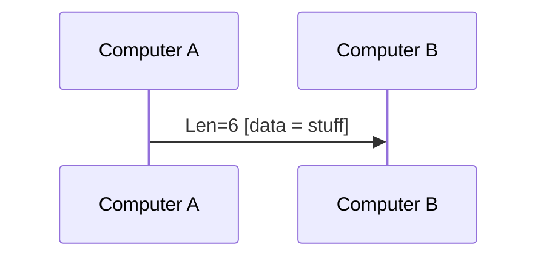

#network 
[[Network MOC]]
- - -

The User Datagram Protocol (UDP) has fast data transmission at the expense of reliability since no handshake is required. This protocol is useful for video and voice chats since speed is more important.

UDP has 0 - 65535 ports, like the [[TCP Protocol]], but these do not conflict with TCP ports.

There is no confirmation, handshake, or teardown for better speed.

